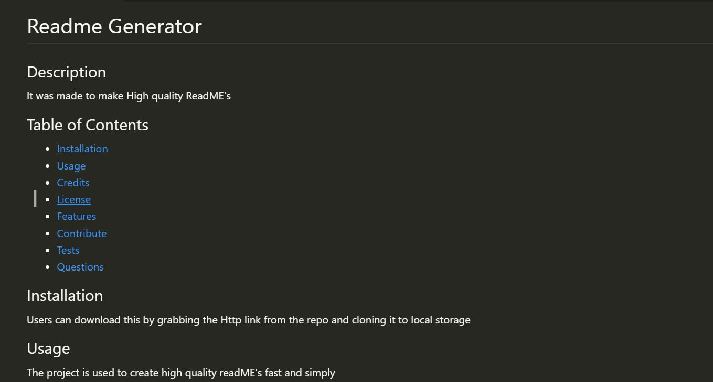

# ReadME Generator

  ## Description
  
  This command line tool creates a ReadME for you with only a few inputs from a User. It saves you time to do more important stuff 
  
  ## Table of Contents

  - [Installation](#installation)
  - [Usage](#usage)
  - [Credits](#credits)
  - [License](#license)
  
  ## Installation
  
  - To Install go to my github repo and clone the repo under the <>Code section
  - https://github.com/TristanM225/ReadMe_Generator
  
  ## Usage
  
 - You can use this tool to quickly make a readME for you with only a few typed inputs
  

      
  
  ## Credits
  
  - Credit for the UCSD coding boot camp repo week 9 NodeJS > Challenge it had all of the skeleton for this code.
  
  ## License
  
N/A
  
  ## Features
  
  - Creates a readME alot faster then typing it out youself!
  
  ## How to Contribute
  
  N/A
  
  ## Tests

N/A

  ## Contact
  
- https://github.com/TristanM225/
- TristanM225@gmail.com
  
  
  